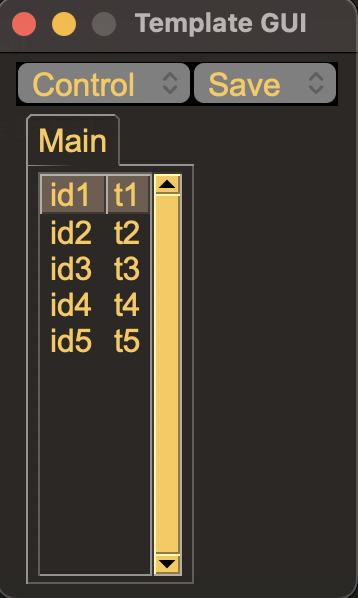
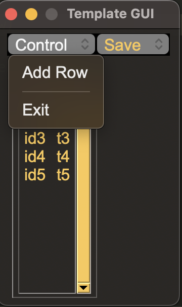
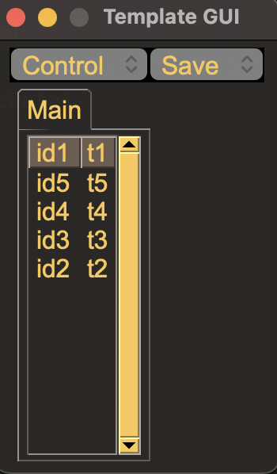

## Template of PySimpleGUI

A template simply read xlsx file (template.xlsx), display data by PySimpleGUI, and save into xlsx.

GUI has two custom menubar, a window tab and a table.

Custom menubar contains 'Add row', 'Save' and 'Exit'.
Clicking the header of the table can sort the table.

